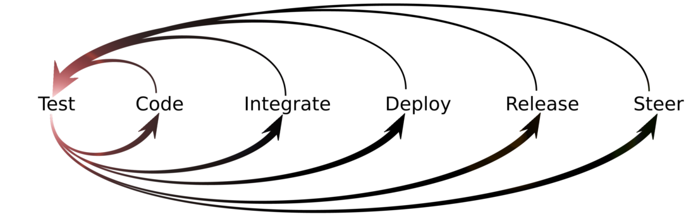

# Spring Boot (Modified) Tutorial – Facilitator Guide

## 1. Purpose

Walk through a simple development exercise that demonstrates several general good development practices.

## 2. Resources

•	Online tutorial page: http://docs.spring.io/spring-boot/docs/current/reference/html/getting-started-first-application.html

•	PowerPoint deck: spring-boot-tutorial.pptx

## 3. Overview

TBD

## 4. Sequence

Start with the deck. The first few slides suggest a goal for the exercise. Take a look at the speaker notes and adjust them according to your own preferences as a guide/mentor.

After the slide that gives particants the URL to the tutorial, switch to this document and follow the sequence of actions below.

### 4.1. Necessary software

Participants will need the following software installed on their machines:

* Java JDK version 1.8
* Maven 3.3 or higher
* Git client
* A text editor (any)
* A Java-aware IDE (if desired)

### 4.2. Getting started

Follow the tutorial section 11.1 to create the ```pom.xml``` file using the command line. Use a text editor, don’t use an IDE yet.

Run ```mvn package``` and ```mvn dependency:tree``` as described in the tutorial.

Explain what a pom is, if necessary, and explain the parent pom named sprint-boot-starter-parent.

Follow the tutorial section 11.2 to add the dependencies to the pom. Run ```mvn dependency:tree``` again as described in the tutorial instructions.

### 4.3. Examining the sample code

Section 11.3 of the tutorial is where we will diverge from the instructions. 

Display the sample Java source code in the tutorial. It looks like this:

```java
import org.springframework.boot.*;
import org.springframework.boot.autoconfigure.*;
import org.springframework.stereotype.*;
import org.springframework.web.bind.annotation.*;

@RestController
@EnableAutoConfiguration
public class Example {

    @RequestMapping("/")
    String home() {
        return "Hello World!";
    }

    public static void main(String[] args) throws Exception {
        SpringApplication.run(Example.class, args);
    }
}
```

Lead a discussion with the group to see if they can identify any issues with this code. If they need a hint, mention _separation of concerns_.

Here's what we're looking for (according to this author, anyway):

The ```main``` method, the "Hello" functionality, and the RESTful service wrapper code are three different _concerns_. In a "real" application, we would not combine these concerns in the same class. For this exercise, we're going to separate these concerns right from the start.

Ask the group if they can see any other potential problems with the code. 

The second thing we're looking for (at least, according to this author) is the fact there are no unit tests; the code is not _test-driven_.

As conscientious developers, we would normally test-drive any new code. Therefore, we're going to do that for this exercise right from the start.

One final issue is that the sample code uses the _default package_. In a "real" application, all Java classes would belong to a package. We're going to start with the default package and refactor the first Java class into a proper package after we've migrated everything into an IDE. For the moment, don't worry about the package.

### 4.4. Creating the Maven directory structure

We're still working on the command line, without using an IDE that "knows" how to create a Maven project automatically.

Create the usual Maven source directories:

```shell
mkdir -p src/main/java
mkdir -p src/test/java
```

Or on Microsoft Windows:

```shell
mkdir src\main\java
mkdir src\test\java
```

On Microsoft Windows only, if command extensions are not enabled on your system, you can write a short script to create directory trees, like this:

```shell
@echo off
setlocal enableextensions
md %1
endlocal
```

### 4.5. Setting up version control

The basis of good development practices such as test-driven development, continuous integration, and continuous deployment is _version control_. Guide participants in creating a git repo on ```github.com```.

Once that has been set up, open a command line window and navigate to the project root directory. Set up a local git repo for the project:

```shell
git init
git config --global user.name "Your Name"
git config --global user.email "youremail@wherever.com"
git remote add origin master [url]
git add .
git commit -m "Initial commit"
```

### 5. Starting development

Now we're set up sufficiently to begin writing some code.

### 5.1. A little up-front planning

Now guide the group through the process of deciding _how_ to separate the concerns in this application:

* Core "business" functionality (in this case, saying "Hello")
* RESTful service wrapper code  
* ```main``` method to run the application as a Java application

Granted, the three pieces will be very small, and this might appear to be a bit pointless to some of the participants. The key idea is that if we _start_ by doing things right, we'll avoid headaches later.

### 5.2. Test-driving the core functionality

Let's begin with the core "business" functionality. The all-important ability to say "Hello" represents a significant competitive advantage for our company. We must be sure to build it well.

The next aspect of sound software development methods we will include in the exercise is _test-driven development_. Here's how that practice is depicted on the C2 wiki:



As the diagram implies, we'll start by writing a test. It's a very small test case that expresses a bit of the expected behavior of the application we're building. We call it a _microtest_.

We're going to use ```JUnit``` as the automated testing framework for this exercise. To add this to the Maven POM as a dependency, add the following definition to the ```pom.xml``` file:

```shell
<dependency>
    <groupId>junit</groupId>
    <artifactId>junit</artifactId>
    <version>4.12</version>
</dependency>
```

Now create a Java class file, ```HelloTest.java```, in the ```src/test/java``` directory. (We're still working with a simple text editor.) Make it something like this:

```java
import org.junit.Test;
import static org.junit.Assert.assertEquals;

public class HelloTest {    
    @Test
    public void itSaysHello() {
        Hello hello = new Hello();
        assertEquals("Hello, World!", hello.greet());
    }
}
```

Walk participants through the test class and explain it. The method ```itSaysHello``` expresses one discrete bit of application behavior. We assume there will be an object of type ```Hello``` that will contain a method named ```greet``` which is expected to return the string, "Hello, World!" when called.

Now run:

```shell
mvn test
```

You'll see errors indicating the symbol ```Hello``` could not be found, like this:

```shell
[ERROR] Failed to execute goal org.apache.maven.plugins:maven-compiler-plugin:3.1:testCompile (default-testCompile) on project myproject: Compilation failure: Compilation failure:
[ERROR] /Users/dave/Documents/Projects/springboot-tutorial/src/test/java/HelloTest.java:[7,9] cannot find symbol
[ERROR] symbol:   class Hello
[ERROR] location: class HelloTest
```

We're now experiencing test-driven development. The _feedback_ from our microtest is telling us to create a Java class named ```Hello```. Who are we to argue?

Create a file named ```Hello.java``` in directory ```src/main/java``` with the following contents:

```java   
public class Hello {
    public String greet() {
        return "Hello, World!";
    }
}
```

Now let's try running the tests again:

```shell  
mvn tests
```

This time we see output like this:

```shell  
Results :
Tests run: 1, Failures: 0, Errors: 0, Skipped: 0
[INFO] ------------------------------
[INFO] BUILD SUCCESS
[INFO] ------------------------------
[INFO] Total time: 2.722 s
[INFO] Finished at: 2016-11-15T16:26:38-06:00
[INFO] Final Memory: 24M/217M
```

People often speak of the _red-green-refactor_ cycle of TDD. Our failing microtest was the _red_ step. Now we've made that microtest pass. That's the _green_ step. 

The third step involves examining the code we've just written to see if it could be simplified. At the moment, there's nothing to refactor, as we haven't build up any _cruft_ in the code. 

We want to establish the habit of examining our code every time we reach _green_ so we can keep the design clean at all times. For now, we'll agree as a team, explicitly, that there's no refactoring to be done at this time.

### 5.3. Committing to version control

Continuous integration (CI) means pushing small changes frequently and checking for integration problems. 

To keep things simple, it's a generally-accepted good practice for all team members to work on a single branch of the source code. The general procedure for committing code with this approach is:

1. Run all tests locally
1. Update local from head
1. Run all tests locally 
1. Push to origin (master branch)
1. Check feedback from the CI build and fix if broken
 
We just ran all tests locally. Let's see if we need to pull any changes from origin.

```shell  
git status
```

You'll see output like this:

```shell  
Daves-MacBook-Pro:springboot-tutorial dave$ git status
On branch master
Your branch is up-to-date with 'origin/master'.
nothing to commit, working directory clean
```

This means we don't have to merge any changes from origin that someone else might have pushed while we were working. We're good to go.

Let's push our changes.

```shell  
git push -u origin master
```

Okay. Now all we have to do is wait for the CI server to run the build. It should start automatically when it detects something was pushed to the version control system.

Tick, tock, tick, tock. Hmm. Nothing is happening.

Oh, wait a second. We forgot to set up the CI server. 

But isn't that someone else's job? Some sort of infrastructure team, or something?

Actually, it isn't someone else's job. If we're the development team, then all aspects of development are part of our job. So, let's get busy!

## 6. Setting up continuous integration

The next loop in the TDD diagram after _test_ and _code_ is _integrate_. Let's set up the Hello project for continuous integration using Travis CI, an online service.

Show participants how to sign up for Travis CI and connect their Github repository to it. Then show them how to add a ```.travis.yml``` file to the project, in the project root directory. Here's the minimum ```.travis.yml``` file for a Java 8 project:

```shell  
language: java
jdk:
  - oraclejdk8
```

Assuming you've set up the repository on Travis CI, when you push the ```.travis.yml``` file to the Github repo it will trigger a build on Travis.

```shell  
git add .travis.yml
git commit -m "Added travis.yml file"
git push -u origin master
```

Display the Travis site in a browser and let participants watch the progress of the build. It won't be as quick as a build on their own CI server, because Travis has to download all the dependencies. If they had their own instance of, say, Jenkins, then the dependencies would be cached in the local ```.m2/repository``` directory on the CI server. 

Ultimately, you'll see the same Maven output on Travis as you see on the local box for ```mvn test```:

```shell  
Running HelloTest
Tests run: 1, Failures: 0, Errors: 0, Skipped: 0, Time elapsed: 0.003 sec - in HelloTest
Results :
Tests run: 1, Failures: 0, Errors: 0, Skipped: 0
```

## 7. Where do we stand?

Now our project is set up to support test-driven development and continuous integration, but not continuous deployment. We don't yet have enough code in place to deploy anywhere; the ```Hello``` class is really a sort of "library" that can be wrapped by some sort of service or driver. 

The tutorial example suggests two kinds of wrappers: A ```main``` driver to function as a standalone "batch" Java application, and a RESTful service.

## 8. Using an Integrated Development Environment

Before we build up any more code, let's move the project into an IDE. It's much more convenient to do serious Java development with an IDE than to use a bare-bones text editor and the command line. IDEs have useful features like code completion, refactoring, in-context javadoc display, boilerplate code generation, import management, stylistic suggestions, and color coding.

You are free to use any IDE you wish. These instructions assume Spring Tool Suite will be used, because it's all based on a Springboot tutorial. This is only for general consistency; Spring Tool Suite isn't an absolute necessity.

To import the project into Spring Tool Suite, start the IDE and right-click in the Package Explorer pane. Choose Import... and then Maven -> Existing Maven projects. 


 Select the root directory of the tutorial project.
 
 
 
It should look something like this:


Now the tutorial project will show up in the Package Explorer pane. It will look something like this:


Now show participants how to run ```mvn test``` from inside the IDE by right-clicking on ```pom.xml``` and choosing Maven -> Run as -> Maven test. You may have to adjust project settings to get it to use the correct JDK and JRE version.

## 9. Creating packages

So far all our code lives in the _default package_. This isn't very realistic. Let's define a Java package. (It's a good excuse to demonstrate the _refactoring_ features of the IDE.)

You can use the keyboard shortcut for the platform you're using or the context menu in the Package Explorer pane in the IDE to choose Refactor -> Move for the file ```HelloTest.java```.


In the refactor dialog window, choose _Create Package_


Give the package whatever name you want, or that your participants choose. 


Do the same for the ```Hello.java``` file.

## 10. Commit to version control from inside the IDE

Now run the tests from inside the IDE. Right-click on ```pom.xml``` and choose Run as... Maven -> Maven test.

Looks good. Let's commit to version control from inside the IDE.

Highlight the project in Package Explorer, right-click to open the context menu, and choose Team -> Commit...


In the Git Staging tab, move the filenames into the Staged Changes section that you want to commit. 


Type in an appropriate commit message.


Now you can press Commit and Push in the lower right-hand area of the Git Staging tab.


Now if you head back over to Travis CI in a browser, you'll see that the CI build was started in response to this push. So, the IDE seamlessly ties into the CI pipeline.

## 11. Write a driver for a standalone Java application

The sample code from the original tutorial has a ```main``` method to run the code as a standalone Java application. We're treating that as a separate concern. Let's write a separate class now with a ```main``` method and have it drive the ```Hello``` class. 

Here there's an opportunity for a discussion about TDD. Should we test-drive the Main class? Some people would argue that every line of production code must be test-driven. Others would say this code is so trivial and so standardized that there's nothing to be gained by test-driving it. It will instantiate a ```Hello``` object and call one method with no arguments, and then exit. That's all. 

### 11.1. The Main class

Let's risk the ire of purists and just write this one.

```java  
package com.nepragma.springboot;
public class Main {	
	static Hello hello;
	public static void main(String[] args) {
		hello = new Hello();
		System.out.println(hello.greet());
		System.exit(0);
	}
}
```

Show them how to run this from inside the IDE. 

### 11.2. Create an executable jar

The way to package a standalone Java application is as an _executable jar_. Let's do that using Maven.

One of the advantages of using Springboot is that it comes with a well-implemented Maven plugin to build executable jars. It works better than the usual ```maven-assembly-plugin``` or ```maven-jar-plugin``` that you may have used in the past.

To include it, add this ```plugin``` declaration to the ```pom.xml``` file:

```shell  
<build>
    <plugins>
        <plugin>
            <groupId>org.springframework.boot</groupId>
            <artifactId>spring-boot-maven-plugin</artifactId>
        </plugin>
    </plugins>
</build>
```

You can create the executable jar from the command line like this:

```shell
mvn package
```

You can also build it from within the IDE. Spring Tool Suite comes with several Maven run configurations predefined, but they don't include one for ```mvn package```. Show participants how to create a new run configuration.


Note that by using the Springboot Maven plugin, you've made the application compatible with Cloud Foundry. Show participants the project properties in Spring Tool Suite:


### 11.3. Run the application

Now you can use that run configuration to create the executable jar from within the IDE using the "Run as..." option from the context menu.

To execute the resulting application from the command line, use:

```shell
java -jar hello-0.0.1-SNAPSHOT.jar
```

To execute it from within the IDE, open the context menu and choose Run as... Java application.

### 11.4 Create a .gitignore file

When we imported the project into Sprint Tool Suite, some IDE-specific files were created in the project directory that we don't want to store in version control. 

The IDE doesn't show hidden files by default. You can make it do so, but it isn't very intuitive. Show participants how to do this. 

First, locate the nearly-invisible drop-down menu button near the upper right-hand corner of the Package Explorer tab.


Choose Filters... to open a dialog where you can control which files appear in Package Explorer. 


Instead of choosing which files to display, you're choosing which files _not_ to display. The entry ```.*resources``` is already checked. Uncheck it to make the IDE show hidden files in Package Explorer.

Show participants how to create a ```.gitignore``` file (or edit the one Springboot generated) to control which files will be committed to version control.

Run a ```git status``` command on the command line to see which files git is watching.

```shell
git status
```

When the author tried this on his laptop, the output from ```git status``` was:

```shell  
On branch master
Your branch is up-to-date with 'origin/master'.
Changes not staged for commit:
  (use "git add/rm <file>..." to update what will be committed)
  (use "git checkout -- <file>..." to discard changes in working directory)

	modified:   .DS_Store
	modified:   README.md
	modified:   pom.xml
	deleted:    src/main/java/Hello.java
	deleted:    target/classes/Hello.class
	modified:   target/maven-archiver/pom.properties
	modified:   target/maven-status/maven-compiler-plugin/compile/default-compile/createdFiles.lst
	modified:   target/maven-status/maven-compiler-plugin/compile/default-compile/inputFiles.lst
	modified:   target/maven-status/maven-compiler-plugin/testCompile/default-testCompile/inputFiles.lst
	deleted:    target/myproject-0.0.1-SNAPSHOT.jar
	modified:   target/surefire-reports/HelloTest.txt
	modified:   target/surefire-reports/TEST-HelloTest.xml
	modified:   target/test-classes/HelloTest.class

Untracked files:
  (use "git add <file>..." to include in what will be committed)

	.classpath
	.gitignore
	.project
	.settings/
	images/mvn-package-run-config.png
	src/main/java/com/nepragma/springboot/Main.java
	src/main/java/com/nepragma/springboot/package-info.java
	src/test/java/com/

no changes added to commit (use "git add" and/or "git commit -a")
```

The ```.DS_Store``` file is created by Mac OSX when you access files. We don't need to keep it in version control. If you're using a different operating system, you won't see that filename in the list.

We don't need anything in the ```target``` directory, as that directory is created as part of the build. We only keep sources and resource files under version control.

The files ```.classpath```, ```.project``` and the director ```.settings``` are generated and used by Spring Tool Suite (actually, by the underlying Eclipse IDE). They are specific to the local development environment and are not part of the application source code, so we don't keep them under version control.

To prevent these files from being stored in git, we put the following entries in ```.gitignore```:

```shell  
.DS_Store
target
.classpath
.project
.settings
```

If you're using another operating system, you might see temporary files specific to that system that you'll want to include in ```.gitignore``` as well. For example, when you edit a file on Ubuntu Linux using the default text editor, it creates a temporary file with a tilde on the end of its name. Editing a file named ```MyClass.java``` will cause another file to be created, named ```MyClass.java~```. You can use wildcards in the filenames in ```.gitignore``` to prevent those files from being included:

```shell  
*~
```

You _do_ want the ```.gitignore``` file itself to be maintained under version control.

### 11.5 Commit, push, and build

Now commit and push the changes and watch the build run in Travis CI.

## 13. Wrap the Hello functionality as a RESTful service

